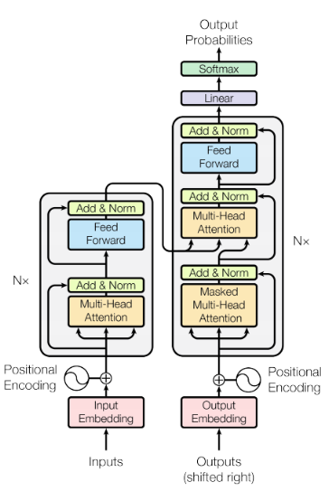

# Text-Summarization

I created text summarization model using *Trax* and *Tensorflow* APIs which take a long article as an input and output the summary of the article in minimum words possible.

(Although, I couldn't finish the training as it will require a lot of time and resource. So, i have to satisfy with small accuracy of the model.)

### Transformer Model

For the text summarization, i used transformer model and train it on ***cnn_dailymail*** dataset which is available on **tensorflow_datasets**.

One layer of the transformer is as follows:-

#### Trax library
Trax is an end-to-end library for deep learning that focuses on clear code and speed. It is actively used and maintained by the Google Brain team. It is fast and good for production level coding and gives good results.
You can find APIs for almost every model in this library.

#### Tensorflow library
TensorFlow is an end-to-end open source platform for machine learning. It has a comprehensive, flexible ecosystem of tools, libraries and community resources that lets researchers push the state-of-the-art in ML and developers easily build and deploy ML powered applications.
The code of *transformer* in **Tensorflow** is from this [link](https://www.tensorflow.org/tutorials/text/transformer) which i tweak a little bit due to memory constraint as the data is so big and i want to use all the dataset for training.
